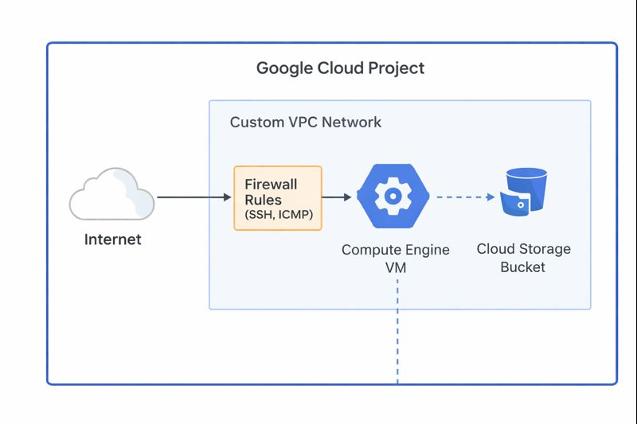
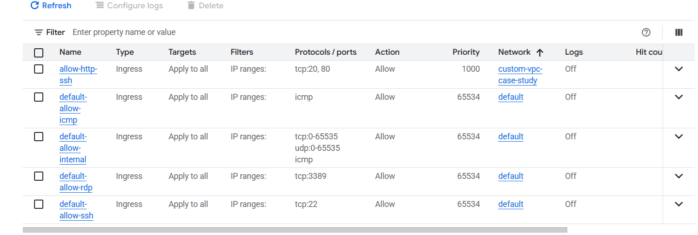

# Google Cloud Infrastructure – Foundation Case Study

## Overview
This repository contains a hands-on case study demonstrating foundational
Google Cloud infrastructure concepts.  
The project was implemented using the **Google Cloud Console**, with the goal
of building a strong conceptual understanding of how core cloud resources
are designed, configured, and managed.

Rather than focusing on automation or Infrastructure as Code, this case study
emphasizes **manual configuration through the console** to strengthen
architectural awareness and practical cloud fundamentals.

---

## Objectives
- Understand core Google Cloud infrastructure services
- Gain practical experience using the Google Cloud Console
- Explore networking, compute, and storage components
- Document architectural design and configuration decisions
- Build a portfolio-ready cloud case study

---

## Architecture
The infrastructure follows a simple and clear foundational design suitable
for learning and experimentation.

The architecture includes:
- A Google Cloud project
- A VPC network for resource isolation
- Firewall rules controlling ingress traffic
- A Compute Engine virtual machine
- A Cloud Storage bucket for object storage

---

## Implementation Details

### Google Cloud Console Usage
All resources in this project were created and managed using the **Google Cloud Console**.
This includes navigating services, configuring resources, reviewing settings,
and understanding relationships between components.

### Networking
- Reviewed VPC networking concepts and structure
- Examined subnet configuration and IP ranges
- Configured firewall rules to allow required traffic such as SSH and ICMP
- Studied Private Google Access and Cloud NAT concepts

### Compute Engine
- Created a Compute Engine virtual machine
- Explored CPU and memory configuration options
- Attached and reviewed persistent disk types
- Examined pricing models and available discounts

### Cloud Storage
- Created a Cloud Storage bucket
- Reviewed storage classes and location options
- Verified access permissions and bucket configuration

---

## Evidence (Google Cloud Console Screenshots)
The following screenshots demonstrate hands-on interaction with the Google
Cloud Console during the implementation of this project.

---

## Key Learnings
- Cloud architecture is driven by networking design
- Understanding the console improves architectural intuition
- Resource configuration directly impacts cost and scalability
- Documentation is a critical part of cloud engineering work

---

## Project Scope Notes
- This project focuses on **foundational infrastructure concepts**
- Automation tools and Infrastructure as Code were intentionally excluded
- The emphasis is on understanding rather than production deployment

---

## References
- Google Cloud Infrastructure Overview  
  https://cloud.google.com/docs/overview
- Virtual Private Cloud (VPC) Documentation  
  https://cloud.google.com/vpc/docs/overview
- Compute Engine Documentation  
  https://cloud.google.com/compute/docs/instances
- Cloud Storage Documentation  
  https://cloud.google.com/storage/docs/introduction
- Google Cloud Architecture Framework  
  https://cloud.google.com/architecture/framework
